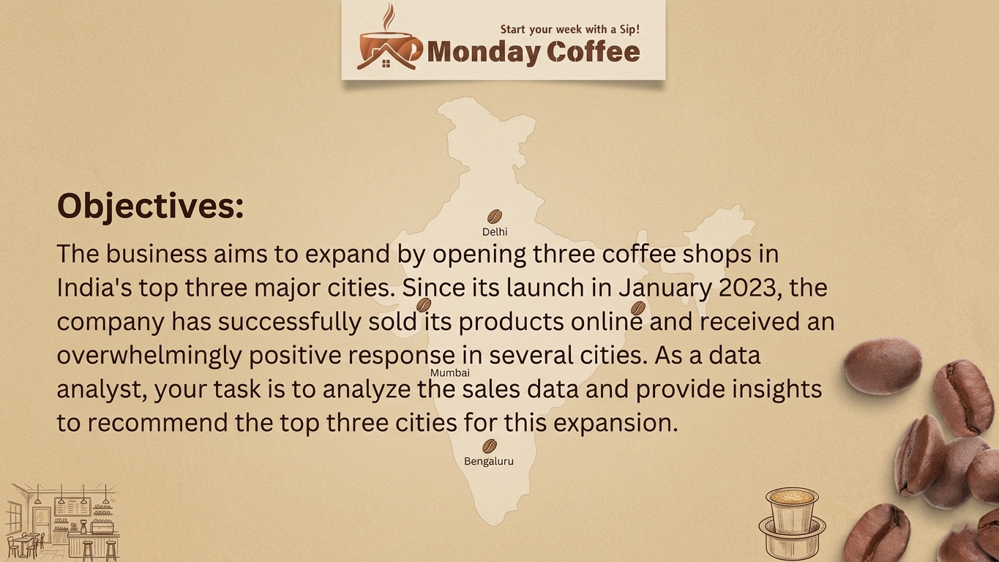

<div align="center">

# ☕ Monday Coffee Expansion Strategy Analysis


<p>


</p>


</div>

---

# 📌 Project Overview


**Monday Coffee** is a rapidly growing coffee chain looking to expand into new cities across India.

Instead of relying on assumptions, this project uses **Advanced SQL Analytics** to identify the best expansion opportunities based on:

- 📈 Revenue Performance
- 👥 Customer Demand
- 💰 Profitability
- ☕ Customer Engagement
- 📍 Market Potential

The goal is to help stakeholders make **data-driven expansion decisions** while minimizing business risk.

<br clear="right"/>

---

# 🎯 Business Problem

> Which cities should Monday Coffee expand into to maximize ROI while minimizing operational costs?

The analysis evaluates multiple KPIs including:

- 💰 Revenue Contribution
- 👥 Customer Growth
- 📦 Order Volume
- ☕ Average Revenue Per Customer
- 📈 High Value Customers
- 🏆 City Rankings

---

# 🛠 SQL Concepts Used

<p align="center">


</p>

---

# 📊 Key Business Analysis

| 📌 Analysis | 📈 Objective |
|------------|--------------|
| 💰 Revenue Contribution | City-wise sales comparison |
| 👥 Market Potential | Estimate customer demand |
| ☕ Engagement Analysis | Revenue per customer |
| 📉 Profitability | Cost vs Revenue |
| 🏆 City Ranking | Best expansion cities |

---

# 💡 SQL Query Showcase

```sql
WITH CustomerSpending AS (
    SELECT
        c.city_id,
        c.customer_id,
        SUM(o.total_amount) AS total_spent,
        NTILE(4) OVER (
            ORDER BY SUM(o.total_amount) DESC
        ) AS spending_tier
    FROM customers c
    JOIN orders o
        ON c.customer_id=o.customer_id
    GROUP BY
        c.city_id,
        c.customer_id
)

SELECT
    ci.city_name,
    COUNT(cs.customer_id) AS high_value_customer_count,
    RANK() OVER(
        ORDER BY COUNT(cs.customer_id) DESC
    ) AS city_rank
FROM CustomerSpending cs
JOIN cities ci
ON cs.city_id=ci.city_id

WHERE spending_tier=1

GROUP BY ci.city_name;
```

---

# 📷 Project Preview

## Dashboard

<p align="center">

</p>

---

## Objective

<p align="center">

</p>

---

## SQL Questions

<p align="center">

</p>

---

## Medium Questions

<p align="center">

</p>

---

## Advanced Analysis

<p align="center">

</p>

---

## Recommendations

<p align="center">

</p>

---

# 🚀 Business Recommendations


### 🎯 Precision Expansion

Identify the Top 3 cities with:

- Highest Average Order Value
- Lowest Customer Acquisition Cost
- Strong Customer Growth

### 🛡 Risk Mitigation

Avoid cities where:

- High operating cost
- Low transaction volume
- Weak customer retention

### 📍 Strategic Planning

Develop a scalable framework for future expansion using SQL-driven insights.

<br clear="right"/>

---

# 📁 Repository Structure

```text
📦 Monday-Coffee-SQL
│
├── 📷 1.Monday Coffee.png
├── 📷 2.Objective.png
├── 📷 3.Easy and Medium Question.png
├── 📷 4.Medium Questions.png
├── 📷 5.Advanced Question & Analysis.png
├── 📷 6.Recommendation & Reason.jpg
├── 📄 README.md
├── 📊 city.csv
├── 📊 customers.csv
├── 📊 products.csv
├── 📊 sales.csv
└── 💾 mysolution.sql
```

---

# 🧠 Skills Demonstrated

<div align="center">

| SQL | Business |
|-----|----------|
| ✔ MySQL | ✔ Business Intelligence |
| ✔ CTE | ✔ Data Storytelling |
| ✔ Window Functions | ✔ Decision Making |
| ✔ Aggregations | ✔ KPI Analysis |
| ✔ Ranking | ✔ Strategic Planning |

</div>

---

# ⭐ Support

If you found this project useful,

⭐ Star this repository

🍴 Fork it

💬 Share your feedback

---

<div align="center">


</div>
